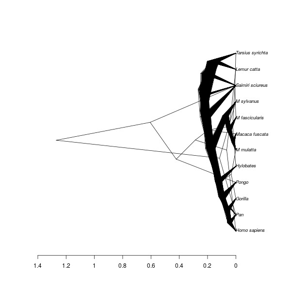

# babette_example_5

Branch   |[](https://travis-ci.org)                                                                                           |[](https://appveyor.com)                                                                                               
---------|--------------------------------------------------------------------------------------------------------------------------------------------------------|--------------------------------------------------------------------------------------------------------------------------------------------------------------------------------------------
`master` |[](https://travis-ci.org/richelbilderbeek/babette_example_5) |[](https://ci.appveyor.com/project/richelbilderbeek/babette-example-5/branch/master)
`develop`|[](https://travis-ci.org/richelbilderbeek/babette_example_5)|[](https://ci.appveyor.com/project/richelbilderbeek/babette-example-5/branch/develop)

A [babette example](https://github.com/richelbilderbeek/babette_examples).

## Example #5: Birth-Death tree prior


```{r example_5}
posterior <- bbt_run(
  "my_alignment.fas",
  tree_prior = create_bd_tree_prior() 
)
```

All other parameters are set to their defaults, as in BEAUti.

## Result


